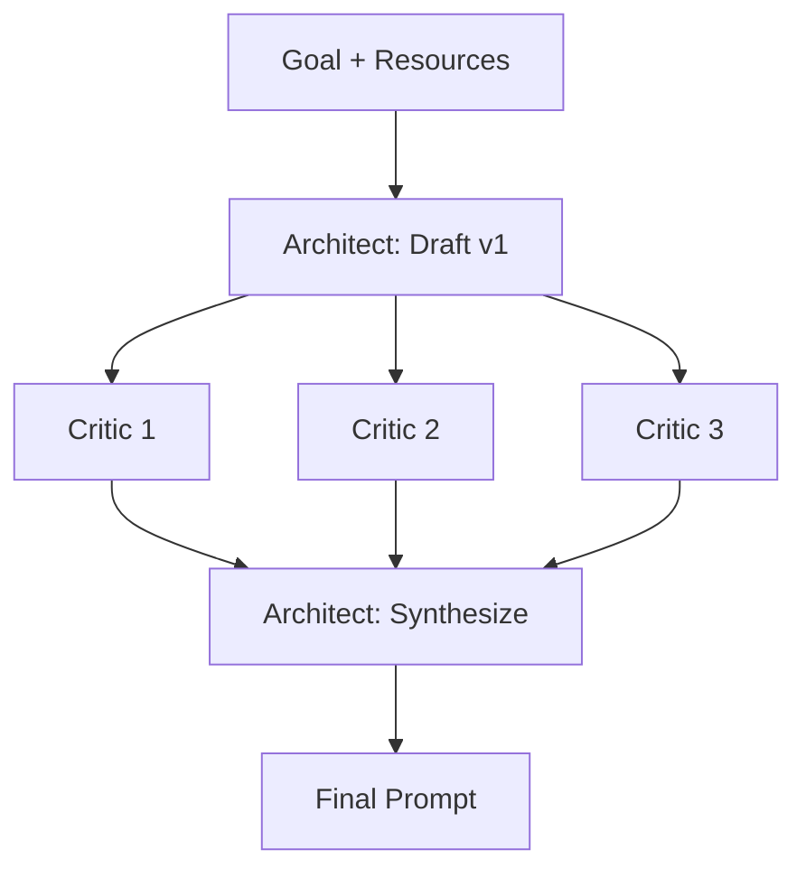

# Multi-LLM Feedback Loop

A hands-on guide to prompt engineering for intermediate practitioners, culminating in an original technique — the **Multi-LLM Feedback Loop** — demonstrated and benchmarked on a concrete task.

**Contents:** [1. Introduction](#1-introduction) · [2. Foundations](#2-foundations-of-prompting) · [3. Toolkit](#3-the-prompt-engineering-toolkit) · [4. The Feedback Loop](#4-the-multi-llm-feedback-loop) · [5. Master Tutorial](#5-the-master-tutorial-5-part-framework) · [6. Case Study](#6-case-study-the-flappy-bird-experiment) · [7. Pitfalls](#7-best-practices--common-pitfalls) · [8. Cheat Sheet](#8-quick-reference-cheat-sheet) · [9. References](#9-references)

## 1. Introduction

Most prompting guides teach isolated techniques — few-shot, chain-of-thought, tree-of-thoughts — but stop short of showing how to *systematically iterate* a prompt toward a high-performance final version. In practice, prompt refinement is usually a solo, single-model loop: you write, you test, you tweak, using your own judgment as the only critic. That makes your prompt only as good as your own blind spots.

This repository documents a different approach. The **Multi-LLM Feedback Loop** treats prompt engineering as peer review: one model (the *Architect*) drafts a prompt, several *independent* models from different training lineages critique it, and the Architect synthesizes their feedback into a refined final prompt. Sections 2–4 build the theory; Section 5 turns it into a repeatable 5-part procedure; Section 6 runs it against two simpler baselines on a real task and reports what actually happened — including where a small local model failed to honor even a well-engineered prompt. The goal is a technique you can apply to your own high-stakes, reusable prompts, plus an honest sense of what it does and doesn't buy you.

## 2. Foundations of Prompting

*Full definitions, the running laptop-repair analogy, and the small-model evidence: [docs/02-foundations.md](docs/02-foundations.md).*

Zero-shot, standard, one-shot, and few-shot prompting form a **ladder of increasing specification**. Zero-shot instructs with no examples, banking entirely on the model's pretrained defaults — handing a specialist a broken laptop and saying *"fix it."* Standard prompting adds explicit requirements, constraints, and context, still without examples — a written description of the symptoms. One-shot supplies a single worked input→output example, the cheapest way to lock a format — one completed repair ticket as a template. Few-shot supplies several deliberately varied examples so the model infers the underlying pattern (in-context learning) — a stack of tickets covering different fault types. The rule of thumb that ties them together: put *behavior* in instructions and *format* in examples; neither substitutes for the other.

**More examples are not always better** — on smaller and local models, extra shots can *degrade* output, through three mechanisms: examples dilute the core instruction (models attend worst to the middle of a long prompt, which is exactly where a big example block puts your constraints); small models overfit to the *surface* patterns of examples — formatting quirks, even topical content — rather than the task logic; and every added token shrinks the instruction's share of the model's attention. The practical rule: **test 1-shot and 3-shot before assuming more**, and treat shot count as a hypothesis to benchmark, not a default.

Small models add one more wrinkle the case study demonstrates twice: **single-run variance** — the same prompt, run again, can drop a requirement it honored the run before. Prompt quality raises the ceiling; a small model in one run doesn't always reach it.

Note too that native **reasoning models** now do chain-of-thought internally by default, so explicit reasoning scaffolds pay off most on the small/local models this repo emphasizes — and it's why the case study's small open-weight generator is a fair test bed rather than an arbitrary pick.

## 3. The Prompt Engineering Toolkit

*Every technique with a minimal example and its tradeoff: [docs/03-toolkit.md](docs/03-toolkit.md).*

The toolkit is organized by function, not alphabetically — three categories answering three different questions.

**How the model reasons.** *Chain-of-Thought* has the model externalize intermediate steps before answering (its zero-shot variant is the famous "let's think step by step"), buying accuracy on multi-step problems at the cost of tokens. *Tree-of-Thoughts* explores multiple reasoning branches, evaluates, and prunes — for planning and search problems with several viable paths. *ReAct* interleaves reasoning with tool actions and observations, grounding the model in real results; it's the foundation of most agentic systems. The *self-correction family* closes the category: **Self-Consistency** samples many reasoning paths and takes the majority answer; **Reflexion** has the model critique its own failed attempt and retry; **Self-Refine** runs generate → self-critique → revise until quality plateaus. Self-Refine is the direct single-model ancestor of this repo's technique — the Feedback Loop is *Self-Refine with the critique step delegated to several independent models* — and its limitation is the motivation: a model reviewing its own draft brings the same blind spots to both.

**How the model improves its own instructions.** *Automatic Prompt Engineering* uses an LLM to generate, score, and select candidate prompts against a metric — an idea that has since matured into automated prompt-optimization tooling like DSPy. *Conversational Prompt Engineering* refines a prompt through human–model dialogue, with the model interviewing you for the requirements you couldn't state cold.

**How you shape behavior through format.** *XML tags* delimit a prompt's parts unambiguously (`<instructions>`, `<context>`, `<success_criteria>`), measurably improving instruction-following — both of the case study's advanced prompts use them throughout. *Emotional prompting* adds stakes or urgency framing; reported gains are real in some models and absent in others, so treat it as a lever worth A/B testing, never as a substitute for an actual requirement. The deep-dive closes with a symptom→technique decision table.

## 4. The Multi-LLM Feedback Loop

*Extended treatment — reconciliation worked from the real Run 1 critiques, roster design, cost math, and variants: [docs/04-feedback-loop.md](docs/04-feedback-loop.md).*

A single model is a weak critic of its own output — the same blind spots that produced the draft limit its self-review. The Feedback Loop diversifies the error-detection surface by routing a draft through several architecturally distinct models, so different reviewers catch different problems, then reconciling their feedback in one place.

**Use it when** a prompt is high-stakes or reused often (production prompts, templates, agents), or when you lack the domain expertise to judge quality yourself. **Skip it when** the task is one-off and low-stakes, or already saturated by a single good CoT/few-shot prompt — the loop multiplies calls (1 draft + N critics + 1 synthesis) and shouldn't be your default.

## 5. The Master Tutorial (5-Part Framework)

*Full walkthrough, including the verbatim critique-request template and copyable checklists: [docs/05-master-tutorial.md](docs/05-master-tutorial.md).*

**1 — Goal Definition.** Before drafting anything, write the goal card: exact output format, audience, *measurable* success criteria (every adjective converted into a check), hard constraints, and an explicit out-of-scope list. These criteria become the validation contract in step 4; skipping this step means discovering your requirements by watching the prompt fail.

**2 — Resource Gathering.** Draft quality is bounded by resource quality: collect reference docs, good and bad examples, and domain constraints before drafting. Prepend `https://r.jina.ai/` to any URL to pull the page as clean, LLM-ready text for grounding (unauthenticated use is rate-limited to roughly 20 requests/minute at the time of writing; a free API key raises it). Version the resources next to the prompt.

**3 — Execution.** The Architect drafts from the goal card and resources; the draft is then **frozen** and sent *unmodified* to 3–5 critics from different training lineages, each in a fresh session, wrapped in a standardized critique request whose load-bearing rule is *list issues, do not rewrite* — a rewrite collapses N independent critiques into N competing drafts. Collect one verbatim transcript per critic, then the Architect synthesizes: consensus adopted, unique catches judged on merit, conflicts arbitrated against the goal card, scope creep declined.

**4 — Validation.** Step 3 reviewed the *prompt*; this step checks the *output*. A model that is **not the generator** grades the result against the step-1 criteria — PASS/FAIL per item, with evidence — and code additionally gets executed, not just read. This step matters: in Section 6 it would have caught the one game-breaking bug that slipped through.

**5 — Finalization.** Save the final prompt as a versioned artifact — its own file, with a provenance header and a changelog mapping each critique to the edit it caused — and re-run the loop when the generator model or the task materially changes.

## 6. Case Study: The Flappy Bird Experiment

*Full write-up, prompts, verbatim critic transcripts, code, and tables: [case-study/README.md](case-study/README.md) and [case-study/benchmark-results.md](case-study/benchmark-results.md).*

The same task — a Flappy Bird clone in Python + `pygame-ce` — was attempted with three prompts of increasing sophistication, all executed by the **same fixed model** (`gpt-oss:20b`), so the only variable is the prompt. Three roles were kept separate: the **Architect/Critics** built the advanced prompt (Claude Opus 4.8 drafted; `gpt-oss:20b`, `qwen3.6:27b`, `gemma4:26b`, `phi4-reasoning:14b` critiqued; Claude Sonnet 5 synthesized), the **generator** (`gpt-oss:20b`) ran every prompt, and the **evaluator** graded the results.

**Two results, and they differ:**

*Prompt quality* improved sharply and monotonically — the Feedback Loop turned a ~9-item draft into a ~15-item final prompt with explicit units, edge cases, and failure modes. This is the technique's actual deliverable, and it worked.

*Generated-code quality* (single run, functional review) did **not** improve monotonically:

| Requirement (verified by testing) | Zero-shot | Standard | Advanced |
|---|:--:|:--:|:--:|
| Frame-rate-independent physics | ✅ | ⚠️ per-frame | ✅ |
| Ground/ceiling collision ends game | ✅ | ✅ | ❌ **missing** |
| Max-fall-speed clamp (anti-tunnel) | ❌ | ❌ | ✅ |
| Start screen / high score | ✅ | ❌ | ❌ |
| **Overall (functional review, /10)** | **8.0** | **7.5** | **7.0** |

The advanced stage produced the best-architected program yet scored lowest, because a single run of the small generator dropped one explicitly-required feature — ground/ceiling collision — that the simpler prompts got right (a no-flap bird sinks through the ground and the game never ends). The lesson isn't that the technique failed; it's that **improving a prompt is not the same as guaranteeing an output.** Prompt quality raises the ceiling; a small model in one run doesn't always reach it — exactly the §2.2 caution, and exactly what the §5.4 validation step would have caught.

## 7. Best Practices & Common Pitfalls

*Recognizable examples for each — several caught live in Run 1: [docs/07-pitfalls.md](docs/07-pitfalls.md).*

| # | Pitfall | One-line fix |
|---|---|---|
| 1 | Over-prompting until the core instruction is lost | Rank and cut requirements; restate the core ask at the end as well as the start |
| 2 | Shot-count bloat (§2.2) | Test 1-shot and 3-shot before more; benchmark, don't assume |
| 3 | Contradictory instructions across a long prompt | Give every parameter one home; do a final conflicts-only read |
| 4 | Treating critic feedback as universally correct | Reconcile, don't concatenate — arbitrate against the goal card |
| 5 | Letting a critic *rewrite* instead of *diagnose* | Enforce "list issues only"; re-request critiques that break the rule |
| 6 | Skipping Goal Definition and iterating blind | Write the goal card first |
| 7 | Conflating the three case-study model roles | Architect & Critics build the prompt; the generator runs it; the evaluator grades it |
| 8 | Forgetting to version-control final prompts | Save prompts as files with a version, provenance header, and changelog |

The deep-dive adds a ninth pitfall Run 1 earned the hard way: skipping output validation (§5.4).

## 8. Quick-Reference Cheat Sheet

| Technique | One-line definition | Use when |
|---|---|---|
| Zero-shot | Instruct with no examples | Task is simple/common |
| One-shot | Supply one input→output example | You need a specific format matched |
| Few-shot | Supply several examples | Pattern matters (watch small-model degradation) |
| Chain-of-Thought | Externalize reasoning before answering | Multi-step logic/math (less needed on reasoners) |
| Tree-of-Thoughts | Explore and prune multiple reasoning branches | Multiple viable paths; planning/search |
| ReAct | Interleave reason → act (tools) → observe | Agentic, tool-using tasks |
| Self-Consistency | Sample many paths, take the majority | One reasoning chain is unreliable |
| Reflexion | Model critiques its own attempt, retries | Iterative self-improvement, no extra models |
| Self-Refine | generate → self-critique → revise | Single-model polish; ancestor of the loop |
| APE | LLM auto-generates/scores candidate prompts | You can define a metric/held-out set (→ DSPy) |
| CPE | Human + LLM refine a prompt via dialogue | Interactive, exploratory prompt design |
| XML tags | Delimit prompt parts with tags | Complex prompts need unambiguous structure |
| Emotional prompting | Add stakes/urgency framing | Worth A/B testing; model-dependent |
| **Multi-LLM Feedback Loop** | Draft → N independent critics → synthesize | High-stakes/reusable prompts needing diverse review |

## 9. References

Grouped by the section they support.

**Section 2 — Foundations**

- Brown, T. et al. (2020). *Language Models are Few-Shot Learners.* arXiv:2005.14165.
- Min, S. et al. (2022). *Rethinking the Role of Demonstrations: What Makes In-Context Learning Work?* arXiv:2202.12837.
- Liu, N. F. et al. (2023). *Lost in the Middle: How Language Models Use Long Contexts.* arXiv:2307.03172.

**Section 3 — Toolkit**

- Wei, J. et al. (2022). *Chain-of-Thought Prompting Elicits Reasoning in Large Language Models.* arXiv:2201.11903.
- Kojima, T. et al. (2022). *Large Language Models are Zero-Shot Reasoners.* arXiv:2205.11916.
- Yao, S. et al. (2023). *Tree of Thoughts: Deliberate Problem Solving with Large Language Models.* arXiv:2305.10601.
- Yao, S. et al. (2022). *ReAct: Synergizing Reasoning and Acting in Language Models.* arXiv:2210.03629.
- Wang, X. et al. (2022). *Self-Consistency Improves Chain of Thought Reasoning in Language Models.* arXiv:2203.11171.
- Shinn, N. et al. (2023). *Reflexion: Language Agents with Verbal Reinforcement Learning.* arXiv:2303.11366.
- Madaan, A. et al. (2023). *Self-Refine: Iterative Refinement with Self-Feedback.* arXiv:2303.17651.
- Zhou, Y. et al. (2022). *Large Language Models Are Human-Level Prompt Engineers.* arXiv:2211.01910.
- Khattab, O. et al. (2023). *DSPy: Compiling Declarative Language Model Calls into Self-Improving Pipelines.* arXiv:2310.03714.
- Ein-Dor, L. et al. (2024). *Conversational Prompt Engineering.* arXiv:2408.04560.
- Li, C. et al. (2023). *Large Language Models Understand and Can Be Enhanced by Emotional Stimuli.* arXiv:2307.11760.
- Anthropic. *Prompt engineering overview* (incl. XML-tag structuring). https://docs.claude.com/en/docs/build-with-claude/prompt-engineering/overview

**Section 4 — The Feedback Loop (related work)**

- Du, Y. et al. (2023). *Improving Factuality and Reasoning in Language Models through Multiagent Debate.* arXiv:2305.14325.

**Section 5 — Tutorial tooling**

- Jina AI. *Jina Reader* (`r.jina.ai`). https://jina.ai/reader/

**Section 6 — Case study**

- OpenAI (2025). *gpt-oss-120b & gpt-oss-20b Model Card.* arXiv:2508.10925. (Apache 2.0 open-weight release.)

**Further Reading** *(deliberately scoped out of this guide)*: DSPy and automated prompt optimization; Step-Back, Least-to-Most, and Graph-of-Thoughts prompting; context engineering; multi-agent orchestration frameworks.

---

*Planning documents (the structure and content specifications this repository was built against) live in [`planning/`](planning/). Released under the [MIT License](LICENSE).*
