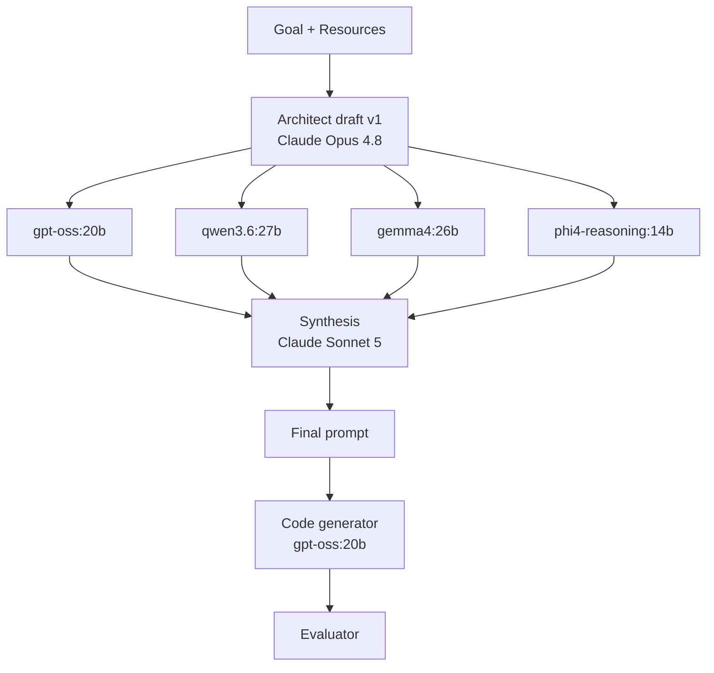

# Case Study: The Flappy Bird Experiment

This is the full Section 6 deep-dive. It documents a single, real run of the Multi-LLM Feedback Loop applied to one concrete task, alongside two simpler prompting baselines, so the technique can be judged against evidence rather than assertion.

> **The one-paragraph result.** The Feedback Loop turned a loosely-specified draft prompt into a rigorous, ~15-requirement final prompt — a large, objective improvement on the axis the technique is meant to move. When that final prompt was then executed by a small local model (`gpt-oss:20b`) in a single run, the resulting program was the best-architected of the three but uniquely dropped one explicitly-required feature (ground/ceiling collision) that the simpler prompts got right. Read together, the run shows the technique reliably improving the *prompt* while a small single-run generator only partly honored it — exactly the behavior the framework's validation step (§5.4) exists to catch.

## Experiment design

The **task** and the **code-generation model** are held constant; the **only** variable is the prompt's sophistication. That is what lets any output difference be attributed to prompting rather than to the model or the task.

Three model roles are kept strictly separate:

| Role | Model(s) used in this run | What it does | Appears in |
|---|---|---|---|
| **Architect + Critics** (build the prompt) | Draft: **Claude Opus 4.8** · Critics: **`gpt-oss:20b`, `qwen3.6:27b`, `gemma4:26b`, `phi4-reasoning:14b`** · Synthesis: **Claude Sonnet 5** | draft → critique → synthesize a prompt | Stage 3 only |
| **Code generator** (run the prompt) | **`gpt-oss:20b`**, held constant | executes each final prompt → `flappy_bird.py` | all 3 stages |
| **Evaluator** (grade the result) | intended: **`gpt-oss:20b`** + fixed rubric (see caveat) | scores each program | all 3 stages |

**Why four *open-weight* critics.** The technique requires critics from *different training lineages* so their blind spots don't overlap. This run used four architecturally distinct open-weight models — OpenAI, Qwen, Gemma, and Phi — instead of frontier API models. That's a legitimate and arguably elegant realization: the entire loop is reproducible on local hardware, at zero cost, which fits the repo's small-/local-model theme.

## Stage 1 — Zero-Shot Baseline

**Prompt** (`01-zero-shot/prompt.md`): a single line — *"Write a Flappy Bird clone in Python using pygame."*

**Output** (`01-zero-shot/flappy_bird.py`): surprisingly complete. `gpt-oss:20b` volunteered a start screen, a persistent high score, dt-based (frame-rate-independent) physics, working ground/ceiling/pipe collision, scoring, and restart — none of it requested. The baseline is not a straw man, which makes the later comparison more credible. Rough edges: a duplicated `GRAVITY` constant and misleadingly-named gap constants (the gap is effectively fixed). Full check: `01-zero-shot/evaluation.md`.

## Stage 2 — Standard Prompt

**Prompt** (`02-standard/prompt.md`): a conventional, careful spec — mechanics, controls, win/lose, scoring, restart, fixed window, no asset files.

**Output** (`02-standard/flappy_bird.py`): clean, type-hinted, well-commented, with time-based pipe spawning and playfield-bounded gaps. Its one clear weakness is **per-frame physics** (gravity and pipe speed are applied once per frame with no time delta), so the game speeds up or slows down if the frame rate drifts — a *regression* versus the zero-shot output, which was dt-based. It also dropped the start screen and high score the baseline had. A vivid reminder that single-run, small-model output is noisy. Full check: `02-standard/evaluation.md`.

## Stage 3 — Advanced (the Multi-LLM Feedback Loop)

This is the only stage where the Architect and Critic roles appear.

1. **Draft (Architect — Claude Opus 4.8):** `03-advanced-feedback-loop/01-architect-draft.md`. A structured, XML-tagged prompt with role framing, explicit success criteria, and a self-review step — but deliberately not airtight (timing model, difficulty curve, determinism, collision precision left open).
2. **Critique (four open-weight critics):** each received the draft *unmodified* via `00-critique-request-template.md`, with the rule *list issues, do not rewrite*. The four raw transcripts are committed **verbatim** in `02-critic-feedback/`, one file per critic.
3. **Synthesize (Architect — Claude Sonnet 5):** the four critiques plus the draft were reconciled into `03-final-prompt.md`.

**What the critics collectively surfaced** *(each item below is traceable to the committed transcripts in `02-critic-feedback/` — e.g., all four critics flagged frame-rate dependence, three flagged unbounded gap placement, and `qwen3.6:27b` alone caught the restart-press-doubles-as-flap issue):* the final prompt added, relative to the draft, (a) **delta-time / frame-rate-independent physics** with explicit units (px/s, px/s²); (b) **edge-triggered flap** so a held key can't auto-repeat; (c) **gap-position clamping** so pipes never sit flush with or off the top/bottom edges; (d) **off-screen pipe removal** to bound memory over long sessions; (e) a **max-fall-speed clamp** to prevent collision tunneling; (f) a **restart debounce** so the game-over keypress doesn't also flap the new run; and (g) an explicit **full-state-reset-and-pause** requirement for the game-over state. Each of these is a concrete failure mode a single reviewer might miss and a diverse panel catches — the technique's whole premise.

**Output** (`03-advanced-feedback-loop/flappy_bird.py`): the best-architected program of the three — the only one with both dt-physics and an anti-tunneling clamp, the cleanest constants and comments, and explicit restart debounce. **But** it is missing ground and ceiling collision entirely, despite the final prompt demanding it three times. Verified empirically: a bird that never flaps sinks straight through the ground to y ≈ 6054 in a 600 px window and the game never ends. Full analysis, including the reproduction, is in `03-advanced-feedback-loop/evaluation.md`.

## Benchmark

The full tables — prompt-quality progression, the verified feature matrix, and the functional-review scores — are in **`benchmark-results.md`**. Summary:

- **Prompt quality:** large, monotonic improvement (≈1 → ≈7 → ≈15 explicit requirements). The technique worked on its actual deliverable.
- **Generated-code quality (single run):** *non-monotonic* — zero-shot 8.0, standard 7.5, advanced 7.0 — because the advanced generation dropped a core required feature the simpler ones kept.

The gap between those two lines is the lesson: **improving a prompt is not the same as guaranteeing an output.** Prompt quality raises the ceiling; a small model in a single run doesn't always reach it. This argues *for* running the complete framework — draft → critique → synthesize → **validate (§5.4)** → finalize — since a validation pass would have caught the missing collision immediately.

## Caveats (also in `benchmark-results.md`)

- Single generation run per stage (no averaging).
- `gpt-oss:20b` was generator, intended grader, *and* one critic → self-preference bias risk; use a distinct grader for a v2.
- The Architect role spanned two Claude models (Opus draft, Sonnet synthesis).
- All `flappy_bird.py` files are committed **verbatim**; documented, not fixed.

## Still needed to finalize

1. The exact **Stage-2 (standard) prompt text**, verbatim → `02-standard/prompt.md` (currently a clearly marked stub).
2. `gpt-oss:20b`'s rubric scores, if the grading step was run, → the "pending" rows in each `evaluation.md`.

*(The four raw critic transcripts, previously listed here, are now committed verbatim in `03-advanced-feedback-loop/02-critic-feedback/`.)*
