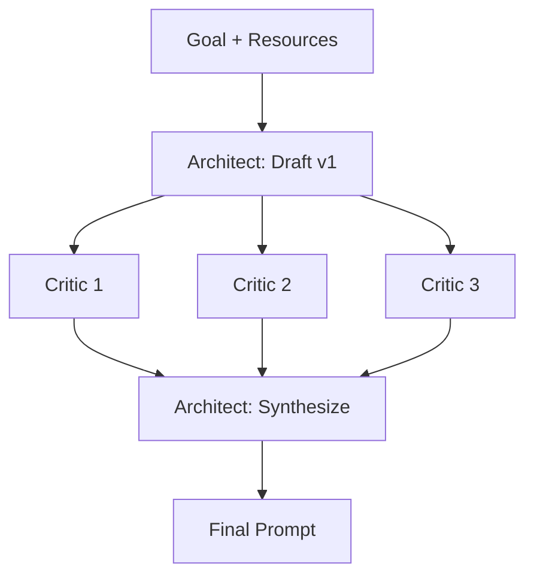

# 4. The Multi-LLM Feedback Loop

*This is the extended version of [README §4](../README.md#4-the-multi-llm-feedback-loop) — the core technique in full, plus the material the README doesn't have room for: how synthesis actually reconciles conflicting critiques (worked from the real Run 1 transcripts), how to choose a critic roster, cost math, variants, and how the loop relates to its neighbors.*

## 4.1 Core concept & why it works

The loop has exactly three steps:

1. **Draft (Architect).** One model — the *Architect* — produces an initial prompt for a defined task, working from the goal definition and resources gathered in [§5.1–5.2](05-master-tutorial.md).
2. **Critique (Critics).** The draft is distributed, **unmodified**, to multiple *different* LLMs — different vendors or model families, not different instances of the same model — which independently review it for ambiguity, missing constraints, failure modes, and structural weaknesses. The critics never see each other's reviews.
3. **Synthesize (Architect, again).** All critiques are fed back to the Architect, which reconciles overlapping or conflicting feedback and produces a refined final prompt in a single voice.

**Why it works — not just what it is.** A single model, even a strong one, has blind spots and biases baked into its own training. When it reviews its own draft, the review is generated by the same distribution that generated the mistakes: whatever assumption made an ambiguity invisible while drafting tends to keep it invisible while critiquing. This is precisely the failure mode that limits pure self-reflection techniques like Reflexion and Self-Refine ([§3.1](03-toolkit.md#the-self-correction-family-self-consistency-reflexion-self-refine)) — the critique is *correlated with the error*.

Using multiple, architecturally distinct models as critics **diversifies the error-detection surface**. Different training data, different instruction-tuning, different failure statistics — so different reviewers catch different problems, for the same reason ensemble methods beat single models and peer review beats self-review in academic writing: reviewers who weren't trained the same way don't share the same blind spots. You don't need any individual critic to be better than the Architect; you need their *misses* to be uncorrelated.

The connection back to [Section 3](03-toolkit.md) is direct: APE, CPE, and Self-Refine established that prompts are objects to be iteratively engineered rather than written once. Each of them, though, funnels all judgment through a single point — one metric, one human–model pair, one model's self-assessment. The Feedback Loop keeps their iteration and replaces the single point of judgment with a panel.

Two structural details do more work than they appear to:

- **The draft travels unmodified.** Every critic reviews the identical artifact, so their critiques are comparable and disagreements are informative. Paraphrasing the draft for each critic destroys that.
- **Critics diagnose; they never rewrite.** The critique-request template ([the real one used in Run 1](../case-study/03-advanced-feedback-loop/00-critique-request-template.md)) demands labeled issues with severity, a quoted span, and a one-line rationale — and explicitly forbids corrected versions. The rationale is covered in [§5.3](05-master-tutorial.md#53-the-execution), but in short: a rewrite collapses N independent critiques into N competing drafts, which defeats the synthesis step. Diagnosis composes; rewrites compete.

## 4.2 When to use it (and when not to)

No technique is universally correct, and stating limits is what keeps this one credible.

**Use it when:**

- the prompt is **high-stakes or will be reused many times** — production prompts, templates, agent system prompts — where the failure cost of a mediocre prompt compounds across every future call;
- **you lack the domain expertise to judge quality yourself** — the critics compensate for *your* blind spots too, not just the Architect's;
- the task has real edge cases and failure modes that a first draft plausibly misses (the case study's draft missed at least seven; see below).

**Avoid or skip it when:**

- the task is **one-off and low-stakes** — the iteration overhead simply isn't worth it;
- you're under **tight latency or cost constraints**;
- the task is already **saturated** by a single well-constructed CoT or few-shot prompt — running a feedback loop against a ceiling wastes calls without improving output.

**Cost honesty.** The loop multiplies calls: 1 draft + N critics + 1 synthesis, **minimum** — Run 1 used six calls (one Opus draft, four local critiques, one Sonnet synthesis) before a single line of the actual task was generated, and the full [Section 5](05-master-tutorial.md) framework adds a validation call on top. Position it as a tool for *important, reusable* prompts, not a default for everything you write. A useful heuristic: if the prompt will be run more times than the loop costs calls, the loop pays for itself quickly; if it will be run once, it usually doesn't.

## 4.3 Synthesis is reconciliation, not concatenation

The synthesis step is where the technique is won or lost, and it is emphatically *not* "apply every suggestion." Critiques overlap, conflict, and vary in quality. The Architect's job is to arbitrate — and every arbitration below actually happened in Run 1 and is traceable to the [committed transcripts](../case-study/03-advanced-feedback-loop/02-critic-feedback/).

**Consensus is the strongest signal — adopt, and make it precise.** All four critics independently flagged the draft's missing frame-rate independence, each rating it High. The synthesis didn't just append "use delta time"; it added a whole `<physics_and_timing>` section with explicit units (px/s, px/s²) and demoted FPS to a rendering cap. All four also flagged unbounded pipe accumulation → an explicit off-screen-removal requirement.

**Majority signals are near-consensus — adopt.** Three of four critics flagged the unbounded random gap position (pipes could spawn off-playfield) → the final prompt's gap-clamping requirement. Two independently flagged the add-vs-set ambiguity of the flap impulse — both rating it High — → "flapping **SETS** the bird's vertical velocity."

**Unique catches are judged on merit, not on vote count.** Only `qwen3.6:27b` noticed that the restart keypress is the *same key as flap*, so the press that restarts the game would also flap the new bird on frame one. One critic out of four, but High severity, obviously correct, and cheap to require → the final prompt's restart-debounce clause. This is the whole argument for lineage diversity: the catch existed because one reviewer's blind spots differed from everyone else's.

**Conflicts get arbitrated against the goal, and critics can be overruled.** Two critics disagreed about the draft's self-verification step: `phi4-reasoning:14b` called it a distraction that "may confuse the implementation process" (Low), while `qwen3.6:27b` flagged the opposite problem — the self-check covered only the success criteria, not the other requirement sections (Medium). The synthesis sided with qwen and *strengthened* the step, expanding verification to every section. A critic being on the panel does not make it right; treating critic feedback as universally correct is [pitfall #4](07-pitfalls.md).

**Scope creep gets declined and logged.** phi4 suggested difficulty progression over time — a reasonable feature, rated Low by its own author, and outside the goal definition. The synthesis left it out. An issue can be *valid* and still not belong in this prompt.

**"No issues found" is an answer, not a failure.** Two critics reported no structural weaknesses rather than inventing some — behavior the template explicitly permits and requests. Without that permission, you get padded critiques full of noise for the Architect to wade through.

The net effect in Run 1: a ~9-requirement draft became a [~15-requirement final prompt](../case-study/03-advanced-feedback-loop/03-final-prompt.md) with units, edge cases, and failure modes spelled out — the full diff is walked through in the [case study](../case-study/README.md).

## 4.4 Choosing the critic roster

**Independence means training-lineage diversity, not size diversity.** Three sizes of one vendor's family share data pipelines, tuning recipes, and therefore blind spots. Prefer one critic each from genuinely different lineages. Run 1 used four open-weight families — OpenAI (`gpt-oss:20b`), Qwen (`qwen3.6:27b`), Gemma (`gemma4:26b`), and Phi (`phi4-reasoning:14b`) — which also made the whole loop reproducible on local hardware at zero marginal cost.

**Three to five critics is the practical sweet spot.** Below three, you barely have diversity; beyond five, synthesis effort grows faster than new unique catches appear.

**Mechanics that protect independence:** fresh session per critic, no shared context, no critic sees another's review, identical template for all, and record each critic's exact model, version, and settings so the run is reproducible. One caveat Run 1 surfaced the hard way: avoid letting the same model wear multiple hats — `gpt-oss:20b` served as critic, generator, *and* intended grader, which creates a self-preference risk on the grading side ([disclosed in the benchmark](../case-study/benchmark-results.md)); use a distinct grader.

**Roster variants, in ascending cost:**

| Roster | Architect | Critics | Best for |
|---|---|---|---|
| Local | local model | 3–5 local open-weight lineages | zero cost, privacy, reproducibility |
| Hybrid *(as run)* | frontier model | local open-weight lineages | strong drafting/synthesis judgment, cheap diverse review |
| Frontier | frontier model | 3–5 frontier lineages | maximum critique quality, paid API costs |

## 4.5 An extended example in a different domain

*(Illustrative, not run data — unlike §4.3, nothing here comes from a logged experiment.)* Suppose the Architect drafts a system prompt for a customer-support triage assistant: classify incoming tickets, answer the easy ones, escalate the rest, be friendly and concise. Plausible findings from a diverse panel, in the template's format:

- **Ambiguity / High** — "escalate when appropriate": no definition of *appropriate*; each model will invent its own threshold. → Synthesis adds concrete escalation triggers (refund requests over a threshold, legal or safety language, second contact on the same issue).
- **Missing requirement / High** — no rule for customers pasting payment-card numbers or passwords into tickets. → Adds a redact-and-never-repeat rule.
- **Failure mode / Medium** — no behavior defined for out-of-scope requests, so the assistant will improvise answers to, say, medical questions. → Adds an explicit decline-and-redirect path.
- **Structural / Medium** — "be concise" conflicts with "always explain your reasoning in full." → Synthesis resolves it: reasoning in an internal field, customer-visible reply capped at 120 words.

Same shape as the Flappy Bird run: consensus items become sections, unique catches get judged, conflicts get resolved against the goal — the loop is domain-agnostic because *underspecification* is domain-agnostic.

## 4.6 What the loop is not

- **Not Self-Consistency.** Self-Consistency diversifies *samples* of one model and ensembles *answers*; the loop diversifies *models* and ensembles *critiques of a prompt*.
- **Not multi-agent debate.** Debate has models argue toward a shared answer, with each seeing the others' positions; the loop keeps critics isolated precisely so they can't anchor or herd, and reserves all reconciliation for one Architect.
- **Not a rewrite committee.** Critics diagnose. One voice — the Architect's — writes.
- **Not an output guarantee.** The loop's deliverable is a **better prompt**. It does not guarantee that any single downstream generation honors that prompt — the case study's advanced stage produced the best-architected program *and* dropped one explicitly-required feature in a single small-model run. That is why the loop lives inside the [Section 5 framework](05-master-tutorial.md), whose §5.4 validation step checks the *output* against the success criteria the loop worked so hard to sharpen.

---

*Next: [Section 5 — The Master Tutorial](05-master-tutorial.md) turns this technique into the middle of a five-part operating procedure. To see the loop's raw artifacts — draft, four transcripts, synthesis — go to the [case study](../case-study/README.md).*
