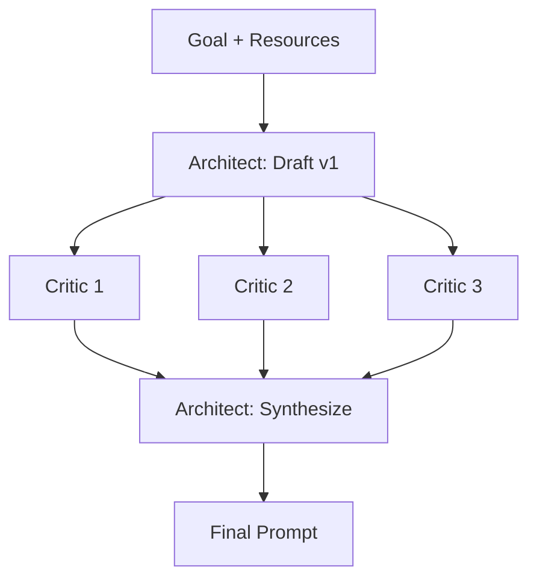

# Content Writing Guide: The Multi-LLM Feedback Loop Repository

**Purpose of this document:** This is your internal planning and briefing file — not repository content itself. Each section below tells you exactly what to write, why it belongs where it does, and what it needs to accomplish before you move to the next one. Treat each entry as a brief you'd hand to a ghostwriter: read it, then draft the actual section content into its corresponding file (see `REPOSITORY_STRUCTURE_GUIDE.md` for where each piece lives).

**Audience reminder:** Intermediate users. Don't re-explain what an LLM is. Do explain *why* a technique works, not just *that* it exists. Every section should answer "so what do I do differently now?"

> **Revision note (this pass).** This file was stress-tested against `REPOSITORY_STRUCTURE_GUIDE.md` and refreshed for currency. Substantive changes and why they were made are logged in **Appendix A: Changelog** at the end. The short version: the two files now agree on where the case study lives (`case-study/`) and that the cheat sheet is not duplicated; the three model roles in the case study are now named explicitly; the technique roster and tool references are current as of mid-2026; and every "open question" is now a locked decision, not a TBD.

---

## Table of Contents

1. [Introduction](#1-introduction)
2. [Foundations of Prompting](#2-foundations-of-prompting)
   - 2.1 [Zero-Shot, Standard, One-Shot, and Few-Shot Prompting](#21-zero-shot-standard-one-shot-and-few-shot-prompting)
   - 2.2 [The Efficiency Tradeoff](#22-the-efficiency-tradeoff)
3. [The Prompt Engineering Toolkit](#3-the-prompt-engineering-toolkit)
   - 3.1 [Reasoning & Structure Frameworks](#31-reasoning--structure-frameworks)
   - 3.2 [Meta-Prompting](#32-meta-prompting)
   - 3.3 [Practical Enhancers](#33-practical-enhancers)
4. [Introducing the Multi-LLM Feedback Loop](#4-introducing-the-multi-llm-feedback-loop)
   - 4.1 [Core Concept & Why It Works](#41-core-concept--why-it-works)
   - 4.2 [When to Use It (and When Not To)](#42-when-to-use-it-and-when-not-to)
5. [The Master Tutorial (5-Part Framework)](#5-the-master-tutorial-5-part-framework)
   - 5.1 [Goal Definition](#51-goal-definition)
   - 5.2 [Resource Gathering](#52-resource-gathering)
   - 5.3 [The Execution](#53-the-execution)
   - 5.4 [Validation](#54-validation)
   - 5.5 [Finalization](#55-finalization)
6. [Case Study: The Flappy Bird Experiment](#6-case-study-the-flappy-bird-experiment)
   - 6.1 [Zero-Shot Baseline](#61-zero-shot-baseline)
   - 6.2 [Standard Prompt](#62-standard-prompt)
   - 6.3 [Advanced Technique-Enhanced Prompt](#63-advanced-technique-enhanced-prompt)
   - 6.4 [Benchmark Results](#64-benchmark-results)
7. [Best Practices & Common Pitfalls](#7-best-practices--common-pitfalls)
8. [Quick-Reference Cheat Sheet](#8-quick-reference-cheat-sheet)
9. [References](#9-references)

---

## 1. Introduction

**Where it lives:** Top of the comprehensive file (`README.md`).

**What to write:** A short abstract, 150–250 words, styled like the abstract of a scientific paper — problem, gap, contribution, promise of payoff, in that order. Open with the problem: most prompting guides teach isolated techniques (few-shot, CoT, ToT) but stop short of showing how to *systematically iterate* a prompt toward a high-performance final version. State the gap: prompt refinement is usually a solo, single-model loop — you write, you test, you tweak, using your own judgment as the only critic. Introduce your contribution: the **Multi-LLM Feedback Loop**, a technique where one LLM drafts, several independent LLMs critique, and the original LLM synthesizes the critiques into a refined final prompt — treating prompt engineering as a peer-review process rather than a solitary one. Close with the payoff: readers will leave with both the underlying theory (Sections 2–4) and a proven, benchmarked example of the technique outperforming simpler prompting strategies (Section 6). Do not explain the technique in detail here — that's Section 4's job. This section's only goal is to hook the reader and set expectations for the rest of the repo.

**Tone note:** Confident and precise, not salesy. Avoid superlatives like "revolutionary" — let the benchmark data in Section 6 do that work later.

---

## 2. Foundations of Prompting

**Where it lives:** Comprehensive file (condensed) + `docs/02-foundations.md` (full depth).

### 2.1 Zero-Shot, Standard, One-Shot, and Few-Shot Prompting

**What to write:** Define each of the four prompting modes in turn, and for each, apply your **Laptop Repair Specialist analogy** consistently so the reader can track progression across all four:

- **Zero-Shot:** You hand the specialist a broken laptop and say "fix it" — no context, no example of what "fixed" looks like, no constraints. Define zero-shot prompting as instructing the model to perform a task with no examples of the desired output, relying entirely on its pretrained knowledge.
- **Standard Prompting:** You add a written description — "the laptop won't turn on, battery is at 40%, no charging light" — more detail, but still no example of a completed repair. Define this as adding explicit task instructions, constraints, or context without providing worked examples.
- **One-Shot:** You show the specialist one completed repair ticket as a template — "here's how I documented the last similar job." Define one-shot as supplying exactly one example of the input-output pattern you want replicated.
- **Few-Shot:** You hand over three or four completed repair tickets covering different fault types, so the specialist can infer the general documentation pattern and apply it to a novel case. Define few-shot as supplying multiple examples to help the model infer a pattern, format, or reasoning style.

For each mode, include: (a) the one-line definition, (b) the analogy beat, (c) a short generic prompt-syntax example (2–3 lines, not full code), (d) one sentence on when an intermediate practitioner would reach for it.

### 2.2 The Efficiency Tradeoff

**What to write:** This is your key nuance and should not be treated as a footnote — give it real space. Explain that increasing the number of shots does not scale performance linearly, and in smaller/lower-parameter models specifically, additional examples can *degrade* output quality rather than improve it. Cover the likely mechanisms an intermediate reader will find credible: (1) smaller context windows and weaker long-range attention mean later examples can dilute or override earlier instructions; (2) smaller models are more prone to overfitting to surface patterns in the examples (e.g., copying formatting quirks rather than the underlying task logic) instead of generalizing; (3) added token length increases the chance of the core instruction getting "lost" relative to the examples. Give a practical rule of thumb: for smaller/local models, test 1-shot and 3-shot before assuming more is better, and treat "more examples" as a hypothesis to benchmark, not a default best practice. Tie this section forward to Section 6, where the reader will see this principle demonstrated empirically.

**Currency note to weave in (added this revision):** Since these techniques were first cataloged, native *reasoning models* (OpenAI's o-series and GPT-5.x, Anthropic's reasoning-enabled Claude, Google's Gemini, DeepSeek-R1, and open-weight reasoners like GPT-OSS) now perform chain-of-thought internally by default. State the practical consequence plainly: explicit CoT/ToT scaffolding yields the *largest marginal benefit on smaller and local models* that don't reason natively, and the *smallest* on frontier reasoners that already do. This isn't a digression — it directly reinforces this section's small-model thesis, and it explains why the case study's evaluator (GPT-OSS-20B, itself a small reasoning model) is a fair, representative test bed rather than an arbitrary pick.

---

## 3. The Prompt Engineering Toolkit

**Where it lives:** Comprehensive file (condensed definitions) + `docs/03-toolkit.md` (full depth per technique).

**Framing note for this whole section:** Open with a short paragraph explaining that this toolkit is organized into three functional categories — not a flat alphabetical list — because each category answers a different question: *how does the model reason* (3.1), *how does the model improve its own instructions* (3.2), and *how do you shape the model's behavior through format and framing* (3.3). This framing paragraph is what prevents the section from reading as a grab-bag, so don't skip it.

### 3.1 Reasoning & Structure Frameworks

**What to write:** Cover the techniques below, each with: a plain-language definition, a minimal illustrative example (a sentence of prompt text, not a full case study — save that for Section 6), and one sentence on the tradeoff (cost, latency, or complexity) it introduces.

- **Chain-of-Thought (CoT):** Prompting the model to externalize intermediate reasoning steps before producing a final answer, improving performance on multi-step logical or arithmetic tasks. Note the tradeoff: longer outputs, higher token cost. (Cross-reference the 2.2 currency note: on native reasoning models this is now often automatic.)
- **Tree-of-Thoughts (ToT):** An extension of CoT where the model explores multiple reasoning branches in parallel, evaluates them, and prunes weaker paths before converging on an answer — useful for problems with multiple viable solution paths. Note the tradeoff: significantly higher compute/latency cost, generally reserved for complex planning or search-like tasks.
- **ReAct (Reason + Act):** A pattern where the model interleaves reasoning steps with actions (e.g., tool calls, searches) and observations, looping until it reaches a final answer — the foundation of most modern agentic systems. Note that this is less about a single prompt and more about a prompting *pattern* used in multi-turn/tool-using systems.
- **Self-Correction Techniques — Self-Consistency, Reflexion, and Self-Refine (grouped):** Explain all three as variations on one core idea — the model checking or improving its own output — while being precise that the mechanisms differ. **Self-Consistency** samples multiple independent reasoning paths for the same problem and takes the majority/most consistent answer. **Reflexion** has the model critique its own prior attempt in natural language and use that critique to generate an improved attempt, often across multiple iterations. **Self-Refine** (added this revision) is the tightest, most widely cited version of the loop today: generate → self-critique → revise, repeated until quality plateaus. Keep each to a tight paragraph, not three long standalone entries. **Why Self-Refine earns its spot:** it is the direct single-model ancestor of the Multi-LLM Feedback Loop — the technique in Section 4 is, in one sentence, "Self-Refine, but the critique step is delegated to several *independent* models instead of the same one." Omitting it in a 2026 guide would look dated and would waste the cleanest possible on-ramp to your core contribution.

### 3.2 Meta-Prompting

**What to write:** This subsection is your conceptual bridge to Section 4, so end it with a transition sentence rather than letting it dead-end. Define:

- **Automatic Prompt Engineering (APE):** Using an LLM to generate, evaluate, and select candidate prompts for a given task automatically, often by generating many variants and scoring them against a metric or held-out examples. **Currency note (added this revision):** flag that APE's ideas have matured into named, tooling-backed *automated prompt optimization* frameworks (e.g., DSPy) that treat prompts as compiled, optimizable modules rather than hand-written strings. One sentence is enough — you're scoping the frameworks themselves out (see Section 9 Further Reading), but a reader should know APE isn't just a 2022 research curiosity.
- **Conversational Prompt Engineering (CPE):** An interactive process where a human and an LLM iteratively refine a prompt together through dialogue — the human states a goal, the LLM proposes a prompt, the human gives feedback, and the LLM revises.

Close the subsection with a bridging paragraph: APE, CPE, and Self-Refine (from 3.1) all demonstrate that prompts themselves can be treated as objects to be engineered, tested, and revised — not just written once. The Multi-LLM Feedback Loop (Section 4) extends this same idea across *multiple independent models acting as critics*, rather than a single model, a single human-model pair, or an automated optimizer scoring against one metric.

### 3.3 Practical Enhancers

**What to write:** Two lightweight, practical techniques, kept brief and concrete:

- **XML Tags:** Using structural tags (e.g., `<context>`, `<instructions>`, `<example>`) to delimit distinct parts of a prompt, which measurably improves instruction-following in many models by making the prompt's structure unambiguous. Include one short example prompt.
- **Emotional Prompting:** Adding stakes, urgency, or emotional framing to a prompt (e.g., "this is critical for my job") which some research and practitioner testing has shown can nudge output quality or effort in certain models. Present this evenhandedly — note that results are model-dependent and inconsistent, so frame it as "a lever worth testing" rather than a guaranteed win.

> **Scope note (do not re-add):** `r.jina.ai` is deliberately **not** a Toolkit technique. It's a resource-gathering *tool*, so it lives in Section 5.2, not here. Earlier drafts placed it in the Toolkit; keep it out.

---

## 4. Introducing the Multi-LLM Feedback Loop

**Where it lives:** Comprehensive file (full — this is your core differentiator and deserves complete treatment in the main file, not just a summary) + optionally `docs/04-feedback-loop.md` for extended examples.

### 4.1 Core Concept & Why It Works

**What to write:** This is the most important section in the repository — write it with the most care. Walk through the three-step loop explicitly:

1. **Draft (Architect):** LLM 'A' produces an initial prompt for a defined task.
2. **Critique (Critics):** The draft is distributed, unmodified, to multiple *different* LLMs (different vendors or model families, not just different instances of the same model) which independently review it for ambiguity, missing constraints, failure modes, and structural weaknesses.
3. **Synthesize (Architect, again):** All critiques are fed back to the original Architect model, which reconciles overlapping or conflicting feedback and produces a refined prompt.

Explain *why* this works, not just what it is: a single model, even a strong one, has blind spots and biases baked into its own training — it's a weak self-critic on its own outputs (the same failure mode that limits pure self-reflection techniques like Reflexion and Self-Refine). Using multiple, architecturally distinct models as critics diversifies the error-detection surface, similar in spirit to ensemble methods or peer review in academic writing — different reviewers catch different blind spots precisely because they weren't trained the same way. Explicitly connect this back to Section 3: APE, CPE, and Self-Refine showed that prompts can be iteratively engineered; this technique scales that iteration across multiple independent evaluators instead of one.

**Diagram (decision locked this revision — see Locked Decisions):** Render the Architect → Critics (parallel) → Architect → Final Prompt flow as an **inline Mermaid diagram** directly in the markdown. GitHub renders Mermaid natively, it version-controls as text, and it needs no image tooling or binary asset. Reuse the same Mermaid block in `case-study/README.md`. A polished exported PNG in `assets/diagrams/` is optional and deferred to a possible v2. A starter block:

````markdown

````

### 4.2 When to Use It (and When Not To)

**What to write:** This section exists to keep the repository credible — no technique is universally correct, and stating limits builds trust. Cover:

- **Use it when:** the task is high-stakes or will be reused many times (production prompts, templates, agents), the failure cost of a mediocre prompt is high, or you're prompting for a domain where you personally lack expertise to judge quality (the critics compensate for your blind spots too).
- **Avoid or skip it when:** the task is one-off/low-stakes (the iteration overhead isn't worth it), you're under tight latency constraints, or the task is simple enough that a single well-constructed CoT or few-shot prompt already performs at ceiling — running a feedback loop against a task that's already saturated wastes calls without improving output.
- **Cost/latency honesty:** Be explicit that this technique multiplies calls (1 draft + N critics + 1 synthesis, minimum), so it should be positioned as a tool for *important, reusable* prompts rather than a default for every prompt you write.

---

## 5. The Master Tutorial (5-Part Framework)

**Where it lives:** Comprehensive file (condensed steps) + `docs/05-master-tutorial.md` (full walkthrough with expanded examples).

**Framing note:** Open this section by telling the reader this is the applied, step-by-step version of everything covered so far — Sections 2–4 were the "what," this is the "how, in order."

### 5.1 Goal Definition

**What to write:** Explain that this step is about producing a precise task specification before writing a single word of prompt. Give the reader a concrete checklist to include: What is the exact output format expected (code, prose, JSON, etc.)? Who or what is the output for? What does "success" look like — is there a measurable criterion? What are the hard constraints (length, language, tools allowed)? Emphasize a common intermediate-level mistake: starting to write the prompt before the goal is fully specified, which causes wasted iteration later in Section 5.3.

### 5.2 Resource Gathering

**What to write:** Cover what context needs to be collected before drafting: reference documentation, examples of desired/undesired output, domain-specific constraints, and prior successful prompts if any exist. This is where **r.jina.ai** belongs — introduce it as a practical tool for pulling clean, LLM-readable text from a URL to use as grounding context in a prompt, and give a one-line usage example (prefix any URL with `https://r.jina.ai/`, e.g., `https://r.jina.ai/https://example.com/docs`). Add the practical caveat (verified current this revision): unauthenticated use is free but rate-limited (roughly 20 requests/minute), and a free API key raises the limit — fine for the manual, low-volume workflow this repo teaches. Frame the whole section around a single idea: the quality of the Architect's first draft in Section 5.3 is bounded by the quality of the resources it's given here.

### 5.3 The Execution

**What to write:** This is where you formally apply the Multi-LLM Feedback Loop from Section 4 as a concrete procedure. Walk through it as an operational sequence: (1) feed the Goal Definition and gathered Resources to the Architect model to produce Draft v1; (2) send Draft v1 as-is to your chosen set of Critic models with a standardized critique request; (3) collect the critiques. Give the reader the actual reusable critique-request template they can copy — the canonical version lives at `case-study/03-advanced-feedback-loop/00-critique-request-template.md`; reproduce it here so this section is self-contained. The template's defining rule: **reviewers list issues, they do not rewrite.** (Rationale to state briefly: a rewrite collapses N independent critiques into N competing drafts, which defeats the synthesis step — you want diagnosis from the critics and synthesis from the Architect, not five rewrites to reconcile.) Note that this section should read as a procedure the reader can literally follow, not just a description.

### 5.4 Validation

**What to write:** Explain the distinction between this step and 5.3's critique step: 5.3 critiques the *prompt itself* before it's ever run; 5.4 validates the *output the prompt produces* once executed, again using secondary LLMs as reviewers. Cover what a good validation request looks like — asking a secondary model to check the output against the original success criteria defined in 5.1, flag hallucinations or unmet constraints, and score quality on a simple rubric. This is also the natural place to introduce the idea of a repeatable evaluation rubric, which sets up Section 6.4's benchmarking approach.

### 5.5 Finalization

**What to write:** Cover the closing step: reconciling validation feedback into a final version, and — since this is a prompt engineering technique — briefly note the discipline of *saving* the final prompt as a versioned artifact (a plain-text or markdown file, with a short changelog comment) rather than letting it live only in a chat window. This one or two sentences on version control sets up Section 7's best practices without needing a full standalone section.

---

## 6. Case Study: The Flappy Bird Experiment

**Where it lives:** Comprehensive file (condensed results table + interpretive paragraph) + `case-study/README.md` (full prompts, full code outputs, full benchmark commentary). **Note (fixed this revision):** the full case study lives in `case-study/README.md`, *not* in `docs/`. It gets its own top-level folder because it produces runnable code across four stages — a different artifact class than a prose deep-dive. There is no `docs/06-case-study.md`; do not create one or link to one.

**Framing note — the experiment's design:** Open with one paragraph stating the design: the same task (a Flappy Bird clone) is attempted using four progressively more sophisticated prompting approaches, and each resulting program is scored by the same evaluator model using a consistent rubric, so results are comparable across stages.

**Three model roles — state these explicitly, up front, and never conflate them (added this revision).** The case study involves three distinct model *roles*. Naming them separately is the single most important clarification in this section, because a reader who conflates "the model that wrote the prompt" with "the model that ran it" or "the model that graded it" will misread the entire benchmark:

1. **Architect & Critic models — the *prompt constructors* (Stage 6.3 only).** The Architect drafts and later synthesizes the advanced prompt; the Critics review the draft. These models *build a prompt*; they never execute it and never grade code. They appear **only** in Stage 6.3, because that is the only stage whose prompt is produced by the Feedback Loop. (Named roster in Locked Decisions.)
2. **The code-generation model — the *prompt executor* (all three stages).** This is the single model that actually *runs* each of the three final prompts (zero-shot, standard, and the synthesized advanced prompt) to produce a Flappy Bird implementation. **It must be held constant across all three stages.** State why explicitly: the experiment's independent variable is the *prompting technique*. If the generating model changed between stages, you could no longer attribute a score difference to the prompt rather than to the model — the comparison would be confounded. Holding the generator fixed is what makes "the prompt improved the output" a defensible claim. (Named model in Locked Decisions.)
3. **The evaluator — the *grader* (all three stages).** GPT-OSS-20B, fixed across all three stages, scores each generated program against a fixed rubric. It never writes prompts and never generates game code; it only grades. Fixing the evaluator (and its rubric, weighting, and reasoning-effort setting) is what makes the three stage scores directly comparable.

A one-line mnemonic worth putting in the prose: **Architect/Critics build the prompt, the generator runs the prompt, the evaluator grades the result — three roles, never merged.**

### 6.1 Zero-Shot Baseline

**What to write:** Show the exact zero-shot prompt used ("Write code for a Flappy Bird clone" or similar minimal instruction — the canonical version is `case-study/01-zero-shot/prompt.md`), executed by the **fixed code-generation model** (role 2). Give a short commentary on what came back — note common failure patterns you'd expect at this stage (missing collision logic, no game-over state, incomplete scoring) without yet giving the numeric score, which belongs in 6.4.

### 6.2 Standard Prompt

**What to write:** Show the upgraded prompt with explicit requirements added (language/framework, game mechanics, controls, win/lose conditions) — canonical version `case-study/02-standard/prompt.md` — again executed by the **same fixed code-generation model**. Briefly note what improved qualitatively versus 6.1.

### 6.3 Advanced Technique-Enhanced Prompt

**What to write:** This is where the Multi-LLM Feedback Loop is actually demonstrated end-to-end on a concrete task, and the only stage where the Architect and Critic roles appear. Show: the Architect's initial draft prompt for the Flappy Bird task (`case-study/03-advanced-feedback-loop/01-architect-draft.md`), a condensed summary of what the Critic models flagged (2–4 bullet points is enough — don't reproduce full critique transcripts here; those live per-critic in `case-study/03-advanced-feedback-loop/02-critic-feedback/`), and the final synthesized prompt that resulted (`03-final-prompt.md`). Make the role boundary visible in the prose: the Architect and Critics produce the *prompt*; that final prompt is then handed to the **same fixed code-generation model** used in 6.1 and 6.2 to produce the actual implementation. This section is your proof-of-concept — treat it as the centerpiece of the whole repository.

### 6.4 Benchmark Results

**What to write:** Present a comparison table with rows for Zero-Shot / Standard / Advanced, and columns for the rubric dimensions you score with GPT-OSS-20B (correctness, completeness, code quality, adherence to constraints), plus an overall score per stage. State the evaluation method explicitly and briefly, per the Locked Decision below:

- **Generation:** one run per stage, produced by the fixed code-generation model at a disclosed, fixed decoding setting (state the temperature/seed you actually used). Disclose single-run generation honestly as a limitation — this is a clear demonstration of technique differences, not a statistically averaged benchmark.
- **Evaluation:** GPT-OSS-20B at a fixed reasoning-effort level (state which — e.g., "Reasoning: medium"), scoring each program **three times** and averaging, to smooth grader-side variance without multiplying the manual generation work. Report the averaged score and, if you like, the spread.

Close with a short interpretive paragraph — not just the raw numbers — connecting the score progression back to the techniques introduced in Sections 2–5. If the Advanced stage wins, say *which* critic-surfaced fixes most plausibly drove the gain; if a stage underperforms expectations (e.g., the efficiency tradeoff from 2.2 shows up), say so — honest results are more credible than a clean monotonic curve.

---

## 7. Best Practices & Common Pitfalls

**Where it lives:** Comprehensive file (condensed list) + optional `docs/07-pitfalls.md` if you want extended examples per pitfall.

**What to write:** A practical, scannable section — bullets are appropriate here more than prose. Cover: over-prompting (piling on constraints until the model loses the core instruction), shot-count bloat (tie back explicitly to Section 2.2), conflicting instructions across a long prompt, treating Critic feedback as universally correct without reconciling contradictions between critics, letting a Critic *rewrite* instead of *diagnose* (tie back to 5.3), skipping Goal Definition (Section 5.1) and iterating blind, conflating the three case-study model roles (tie back to Section 6), and forgetting to version-control final prompts (tie back to Section 5.5). Each pitfall: one sentence describing it, one sentence on the fix.

---

## 8. Quick-Reference Cheat Sheet

**Where it lives:** Comprehensive file **only** (this section's entire value is being in the one place people bookmark) — do **not** split this into the deep-dive docs, and do **not** create a separate `docs/glossary.md` for it. (This was a source of contradiction with the structure guide; both files now agree: cheat sheet is README-only, not duplicated.)

**What to write:** A single table or tightly formatted list mapping every named technique in the repo — Zero/One/Few-Shot, CoT, ToT, ReAct, Self-Consistency, Reflexion, **Self-Refine**, APE, CPE, XML tags, Emotional Prompting, and the Multi-LLM Feedback Loop — to a one-line definition and a "use when" tag. (Self-Refine added this revision to match the roster change in 3.1.) This is a lookup tool, not a teaching tool — keep every entry to one line.

---

## 9. References

**Where it lives:** Comprehensive file, final section.

**What to write:** List sources actually used while researching each technique (papers, official documentation, blog posts) grouped by the section they support, plus a short **"Further Reading"** subsection pointing toward adjacent topics you deliberately scoped out so readers know the technique's place in the wider landscape without you having to teach it here. Scoped-out adjacents worth naming (refreshed this revision): automated prompt-optimization frameworks such as **DSPy** (the tooling successor to APE, from 3.2); reasoning-path variants not covered in 3.1 — **Step-Back**, **Least-to-Most**, **Graph-of-Thoughts**; the broader discipline of **context engineering**; and **multi-agent orchestration frameworks** (the natural next step beyond a single feedback loop). For GPT-OSS-20B, cite the OpenAI model card (arXiv 2508.10925, August 2025, Apache 2.0). For r.jina.ai, cite the Jina Reader docs.

---

## Locked Decisions (resolved — reflects the actual Run 1)

These replace the former "Open Questions to Resolve" list. The roster and methodology below record **what was actually used in Run 1**, which differed from the pre-registered plan — drafting documents the real experiment, not the hypothetical one.

- **Model roster (Section 6.3) — as run.**
  - **Architect (draft v1):** Claude Opus 4.8 (Anthropic).
  - **Critics (four architecturally distinct open-weight lineages):** `gpt-oss:20b` (OpenAI), `qwen3.6:27b` (Alibaba/Qwen), `gemma4:26b` (Google/Gemma), `phi4-reasoning:14b` (Microsoft/Phi).
  - **Synthesis (final prompt):** Claude Sonnet 5 (Anthropic).
  - *Rationale & note:* The premise — a diverse error-detection surface from *different training lineages* — is fully satisfied by four distinct open-weight families, and using local models makes the whole loop reproducible at zero cost, which suits the repo's small-/local-model theme. Two deviations from the original plan are recorded honestly: the critics are local open-weight models rather than frontier API models (a legitimate, arguably better choice here), and the Architect role spanned two Claude models (Opus drafted, Sonnet synthesized) rather than one.
- **Benchmark methodology (Section 6.4) — as run and going forward.** One code-generation run per stage, generator (`gpt-oss:20b`) held constant. Evaluation intended as `gpt-oss:20b` + fixed rubric; Run 1's committed scores are an independent functional review (each program run headlessly + code inspection) with the `gpt-oss:20b` rubric slot left open.
  - *Rationale & caveat:* Manual by-hand execution across separate chat UIs makes N-run *generation* impractical, so generation is single-run and disclosed. **Important caveat surfaced by Run 1:** `gpt-oss:20b` was generator, intended grader, *and* one of the four critics — a model grading its own output risks self-preference bias, so a **different grader is recommended for v2**. For grading noise, re-grading the same saved program 3× and averaging remains cheap and advisable once a distinct grader is chosen.
- **Code language/framework (Section 6).** Python + **pygame-ce** (the actively maintained community fork of Pygame; `pip install pygame-ce`, import is still `import pygame`).
  - *Rationale:* Pygame remains the standard for a compact, single-file, runnable 2D game and keeps output length manageable. pygame-ce is the maintained fork by the former core developers, a near drop-in replacement with current Python 3.13/3.14 support — the right "still-standard-but-current" choice for 2026. Generated code that uses plain `import pygame` runs unchanged on either distribution.
- **Diagrams (Section 4.1).** Inline **Mermaid** diagram in the markdown for v1 (reused in `case-study/README.md`); a polished exported PNG in `assets/diagrams/` is optional and deferred.
  - *Rationale:* GitHub renders Mermaid natively, it version-controls as text, and it needs no image tooling — strictly better than a hand-exported PNG for a v1 that will keep changing.
- **Evaluator (Section 6.4).** GPT-OSS-20B remains the intended grader, **but decouple it from the generator in v2.**
  - *Rationale:* Still confirmed current (OpenAI open-weight, Apache 2.0, ~16 GB, ~o3-mini on reasoning/coding); `gpt-oss-safeguard` is for policy classification, not code grading. **Run 1 lesson:** because `gpt-oss:20b` was *also* the generator (and a critic), it graded its own output — a self-preference risk. Keep gpt-oss-class models as an option, but for v2 use a grader from a *different* lineage than the generator, and fix its reasoning-effort setting for reproducibility.

---

## Appendix A: Changelog (what changed this revision and why)

- **Case-study location unified.** Removed all references to `docs/06-case-study.md`; the full case study lives in `case-study/README.md`. *Why:* the two planning files disagreed; the `case-study/` folder is the better home because the artifact includes runnable code, and the structure guide's own mapping table already pointed there.
- **Cheat-sheet duplication removed.** Reaffirmed cheat sheet is README-only and explicitly forbade a `docs/glossary.md`. *Why:* the structure guide's file tree listed a glossary that duplicated Section 8, contradicting both this guide and the structure guide's own mapping table.
- **Three model roles named.** Added an explicit Architect/Critic vs. code-generation vs. evaluator distinction to Section 6 and each subsection, including the "hold the generator constant" rationale. *Why:* the ambiguity would confound the benchmark and confuse a reader running it later.
- **Self-Refine added; APE modernized; reasoning-model note added.** *Why:* Self-Refine is the direct single-model ancestor of the core technique and is now standard in current rosters; APE's modern form is tooling-backed optimization (DSPy); native reasoning models change where CoT/ToT pay off. All three keep a 2026 guide from reading as if written in 2023.
- **Tooling currency confirmed.** GPT-OSS-20B, r.jina.ai, and Python+Pygame all verified current; Pygame updated to pygame-ce; r.jina.ai rate-limit caveat added.
- **Open questions → Locked Decisions.** All four former TBDs are now decided with rationale.
- **Minor tightening.** Clarified the "list issues, don't rewrite" rule in 5.3 with its rationale; removed the stale "per the structural review" breadcrumb around r.jina.ai; added cross-references so pitfalls in Section 7 point back to the sections that introduce them.

## Appendix B: Run 1 outcome (post-experiment update)

The experiment has now been run once. Key facts the drafter of §6 must honor:

- **Roster as run** (see Locked Decisions): Architect draft = Opus 4.8; four open-weight critics (`gpt-oss:20b`, `qwen3.6:27b`, `gemma4:26b`, `phi4-reasoning:14b`); synthesis = Sonnet 5; generator + intended grader = `gpt-oss:20b`.
- **The result is *not* a clean monotonic win, and §6 must say so.** Prompt quality improved sharply and monotonically (≈1 → ≈7 → ≈15 explicit requirements) — the technique's real deliverable. But the *generated code* scored non-monotonically (zero-shot 8.0, standard 7.5, advanced 7.0 on independent functional review), because the single advanced generation **dropped a required feature — ground/ceiling collision — verified by testing** (a no-flap bird sinks through the ground and the game never ends). The zero-shot output was unexpectedly strong; the standard output regressed to per-frame physics.
- **Framing for §6 (do not spin).** State plainly that the Feedback Loop improved the *prompt*, and that a small single-run generator only partly honored it — which is the §2.2 small-model caution in action and precisely what the §5.4 validation step would have caught. The honest result argues *for* the full 5-part framework, and is more credible than a manufactured clean curve.
- **Artifacts are verbatim.** The three `flappy_bird.py` files are committed exactly as generated; bugs are documented in each `evaluation.md`, not fixed.
- **Still pending:** the four raw critic transcripts and (if the grading step was run) `gpt-oss:20b`'s own rubric scores.
